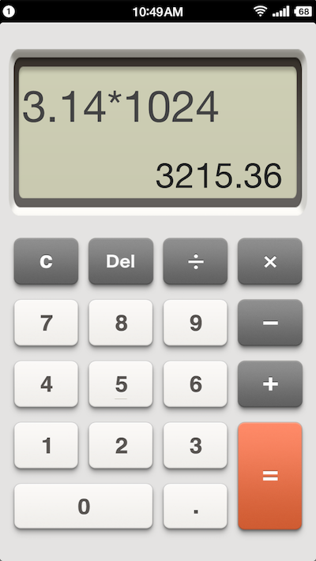
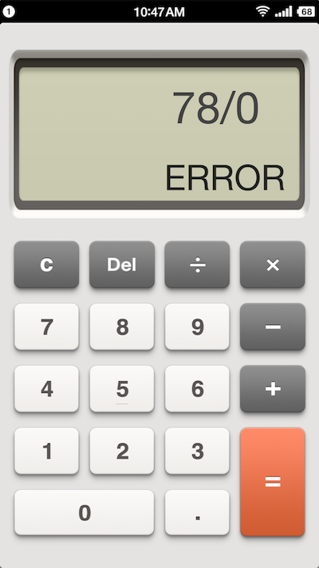

# Voice calculator


This Android app is written by `Ruby` with the advantage of `RubyMotion`.
(Only support **Android 5.1+** )
## Features

- Providing digit voice when clicking (in Mandarin)

- Concise UI coping from [Smartisan Calculator](http://www.smartisan.com/#/home)

## Test and Run

`RubyMotion` only supports `Mac OS X`.

After you download and install `RubyMotion`, it will download all the necessary Android SDK for you,

```
# run on the device (make sure the USB debugger is allowed)
$ rake device

# or run on the emulator (recommend Genymotion)
$ rake emulator
```

You can also download the current version at [DropBox](https://www.dropbox.com/s/ljlv33w4a3i1xv7/%E8%AF%AD%E9%9F%B3%E8%AE%A1%E7%AE%97%E5%99%A8.apk?dl=0) or [Baidu](http://pan.baidu.com/s/1skm3Gw1).

## Screenshots

 

## Acknowledgements

All the audio files are downloaded from `Google Translator`.
